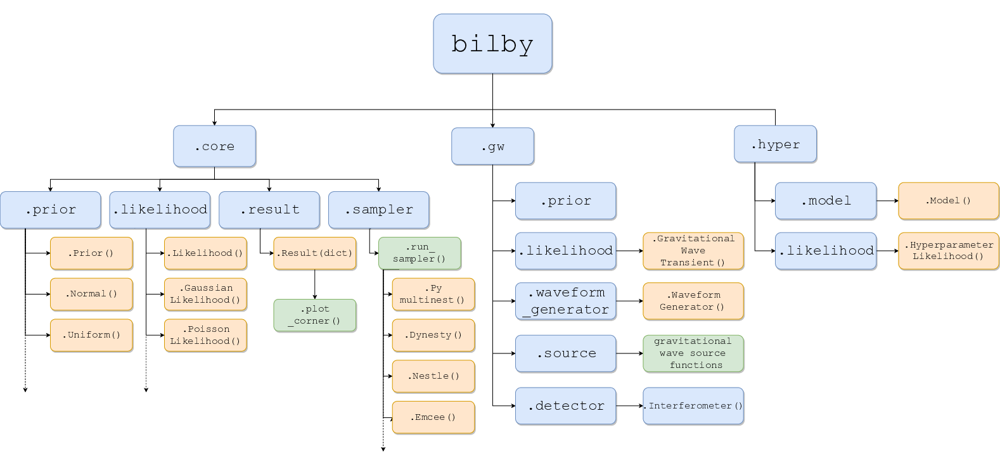

# Contributing to bilby

This is a short guide to contributing to bilby aimed at general LVC members who
have some familiarity with python and git.  

1. [Code of conduct](#code-of-conduct)
2. [Code style](#code-style)
3. [Code relevance](#code-relevance)
4. [Merge requests](#merge-requests)
5. [Typical workflow](#typical-workflow)
6. [Hints and tips](#hints-and-tips)
7. [Code overview](#code-overview)


## Code of Conduct

Everyone participating in the bilby community, and in particular in our issue
tracker, merge requests, and chat channels, is expected to treat other people
with respect and follow the guidelines articulated in the [Python Community
Code of Conduct](https://www.python.org/psf/codeofconduct/).

## Code style

During a code review (when you want to contribute changes to the code base),
you may be asked to change your code to fit with the bilby style. This is based
on a few python conventions and is generally maintained to ensure the code base
remains consistent and readable to new users. Here we list some typical things
to keep in mind ensuring the code review is as smooth as possible

1. We follow the [standard python PEP8](https://www.python.org/dev/peps/pep-0008/) conventions for style. While the testing of this is largely automated (the C.I. pipeline tests check using [flake8](http://flake8.pycqa.org/en/latest/)), some more subjective things might slip the net. 
2. New classes/functions/methods should have a docstring and following the [numpy docstring guide](https://numpydoc.readthedocs.io/en/latest/format.html), for example
```python
def my_new_function(x, y, print=False):
    """ A function to calculate the sum of two numbers
    
    Parameters
    ----------
    x, y: float
        Input numbers to sum
    print: bool
        If true, print a message
    """
    if print:
        print("Message!")
    return x + y
```
3. Avoid inline comments unless necessary. Ideally, the code should make it obvious what is going on, if not the docstring, only in subtle cases use comments
4. Name variables sensibly. Avoid using single-letter variables, it is better to name something `power_spectral_density_array` than `psda`.
5. Don't repeat yourself. If code is repeated in multiple places, wrap it up into a function.
6. Add tests. The C.I. is there to do the work of "checking" the code, both now and into the future. Use it.

## Automated code checking

In order to automate checking of the code quality, we use
[pre-commit](https://pre-commit.com/). For more details, see the documentation,
here we will give a quick-start guide:
1. Install and configure:
```console
$ pip install pre-commit  # install the pre-commit package
$ cd bilby
$ pre-commit install
```
2. Now, when you run `$ git commit`, there will be a pre-commit check.
   This is going to search for issues in your code: spelling, formatting, etc.
   In some cases, it will automatically fix the code, in other cases, it will
   print a warning. If it automatically fixed the code, you'll need to add the
   changes to the index (`$ git add FILE.py`) and run `$ git commit` again. If
   it didn't automatically fix the code, but still failed, it will have printed
   a message as to why the commit failed. Read the message, fix the issues,
   then recommit.
3. The pre-commit checks are done to avoid pushing and then failing. But, you
   can skip them by running `$ git commit --no-verify`, but note that the C.I.
   still does the check so you won't be able to merge until the issues are
   resolved.
If you experience any issues with pre-commit, please ask for support on the
usual help channels.


## Code relevance

The bilby code base is intended to be highly modular and flexible. We encourage
people to "develop into" the code base new features and tools that will be
widely used. On the other hand, if you are developing a tool which might be
highly specialised, it might make more sense to develop a separate python
module which **depends** on bilby, but doesn't need to live in the bilby source
code.  Adding code into the bilby source comes with advantages, but also adds
complexity and review burden to the project. If you are unsure where it should
live, open an issue to discuss it. 

## Merge requests

All changes to the code base go through the [merge-request
workflow](https://docs.gitlab.com/ee/user/project/merge_requests/) Anyone may
review your code and you should expect a few comments and questions. Once all
discussions are resolved, core developers will approve the merge request and
then merge it into the master branch. If you go a few days without a reply,
please feel free to ping the thread by adding a new comment.

All merge requests should be focused: they should aim to either add one
feature, solve one bug, or fix some stylistic issues. If multiple changes are
lumped together it can slow down the process and make it harder to review.

Before you begin: we highly recommend starting by opening an issue laying out
what you want to do, especially if your change will be a significant amount of
work to write. This lets a conversation happen early in case other
contributors disagree with what you'd like to do or have ideas that will help
you do it.

Comments and questions may pertain to the functionality, but they may also
relate to the code quality. We are keen to maintain a high standard of the
code. This makes it easier to maintain, develop, and track down buggy
behaviour. See the [Code style](#code-style) Section for an overview.

**Reviewing Changes**

If you are reviewing a merge request (either as a core developer or just as an
interested party) please keep these three things in mind

* If you open a discussion, be timely in responding to the submitter. Note, the
  reverse does not need to apply.
* Keep your questions/comments focused on the scope of the merge request. If
  while reviewing the code you notice other things which could be improved,
  open a new issue.
* Be supportive - merge requests represent a lot of hard work and effort and
  should be encouraged.

Reviewers should follow these rules when processing merge requests:

* Always wait for tests to pass before merging MRs.
* Delete branches for merged MRs (by core devs pushing to the main repo).
* Make sure related issues are linked and (if appropriate) closed.
* Squash commits

## Typical workflow

Bilby uses the fork and merge model for code review and contributing to the
repository. As such, you won't be able to push changes to the master branch.
Instead, you'll need to create a fork, make your changes on a feature branch,
then submit a merge request. The following subsections walk you through how to
do this. 

### Step a) getting started

All the code lives in a git repository (for a short introduction to git, see
[this tutorial](https://docs.gitlab.com/ee/gitlab-basics/start-using-git.html))
which is hosted here: https://git.ligo.org/lscsoft/bilby.  If you haven't
already, you should
[fork](https://docs.gitlab.com/ee/gitlab-basics/fork-project.html) the
repository and clone your fork, i.e., on your local machine run

```bash
$ git clone git@git.ligo.org:albert.einstein/bilby.git
```

replacing the SSH url to that of your fork. This will create a directory
`/bilby` containing a local copy of the code. From this directory, you can run

```bash
$ pip install -e .
```

which will install `bilby` using the python package installer `pip`.  The `-e`
argument will mean that when you change the code your installed version will
automatically be updated.

### Step b) Updating your fork

If you already have a fork of bilby, and are starting work on a new project you
can link your clone to the main (`lscsoft`) repository and pull in changes that
have been merged since the time you created your fork, or last updated:

**Link your fork to the main repository:** from the directory `/bilby`
containing a local copy of the code:

```bash
$ git remote add lscsoft https://git.ligo.org/lscsoft/bilby
```

You can see which "remotes" you have available by running

```bash
$ git remote -v
```

**Fetch new changes from the `lscsoft` repo:**

```bash
$ git pull lscsoft master
```

### Step c) Creating a new feature branch

All changes should be developed on a feature branch, in order to keep them
separate from other work, simplifying review and merging once the work is done.
To create a new feature branch:

```bash
$ git pull lscsoft
$ git checkout -b my-new-feature lscsoft/master
```

### Step d) Hack away

1. Develop the changes you would like to introduce, using `git add` to add files with changes. Ideally commit small units of change often, rather than creating one large commit at the end, this will simplify review and make modifying any changes easier.
2. Commit the changes using `git commit`. This will prompt you for a commit message. Commit messages should be clear, identifying which code was changed, and why. Common practice (see e.g. [this blog](https://chris.beams.io/posts/git-commit/)) is to use a short summary line (<50 characters), followed by a blank line, then more information in longer lines.
3. Push your changes to the remote copy of your fork on git.ligo.org

```bash
git push origin my-new-feature
```
**Note:** For the first `push` of any new feature branch, you will likely have
to use the `-u/--set-upstream` option to `push` to create a link between your
new branch and the `origin` remote:

```bash
git push --set-upstream origin my-new-feature
```

### Step e) Open a Merge Request

When you feel that your work is finished, or if you want feedback on it, you
should create a Merge Request to propose that your changes be merged into the
main (`lscsoft`) repository.

After you have pushed your new feature branch to `origin`, you should find a
new button on the [bilby repository home
page](https://git.ligo.org/lscsoft/bilby) inviting you to create a Merge
Request out of your newly pushed branch.  You should click the button, and
proceed to fill in the title and description boxes on the MR page. If you are
still working on the merge request and don’t want it to be merged accidentally,
add the string "WIP", "work in progress" or "do not merge" (not
case-sensitive), to the title.

Once the request has been opened, one of the maintainers will assign someone to
review the change.

## Hints and tips

### Licence
When submitting a MR, please don't include any license information in your
code. Our repository is
[licensed](https://git.ligo.org/lscsoft/bilby/blob/master/LICENSE.md). When
submitting your merge request, we will assume you have read and agreed to the
terms of [the
license](https://git.ligo.org/lscsoft/bilby/blob/master/LICENSE.md).

### Removing previously installed versions

If you have previously installed `bilby` using `pip` (or generally find buggy
behaviour), it may be worthwhile purging your system and reinstalling. To do
this, first find out where the module is being imported from: from any
directory that is *not* the source directory, do the following

```bash
$ python
>>> import bilby
>>> print(bilby.__file__)
/home/user/anaconda2/lib/python2.7/site-packages/bilby-0.2.2-py2.7.egg/bilby/__init__.pyc
```
In the example output above, we see that the directory that module is installed
in. To purge our python installation, run

```bash
$ rm -r /home/user/anaconda2/lib/python2.7/site-packages/bilby*
```

You can then verify this was successful by trying to import bilby in the python
interpreter.


## Code overview

Below, we give a schematic of how the code is structured. This is intended to
help orient users and make it easier to contribute. The layout is intended to
define the logic of the code and new merge requests should aim to fit within
this logic (unless there is a good argument to change it). For example, code
which adds a new sampler should not effect the gravitational-wave specific
parts of the code. Note that this document is not programatically generated and
so may get out of date with time. If you notice something wrong, please open an
issue.



**Note** this layout is not comprehensive, for example only a few example "Priors" are shown.
